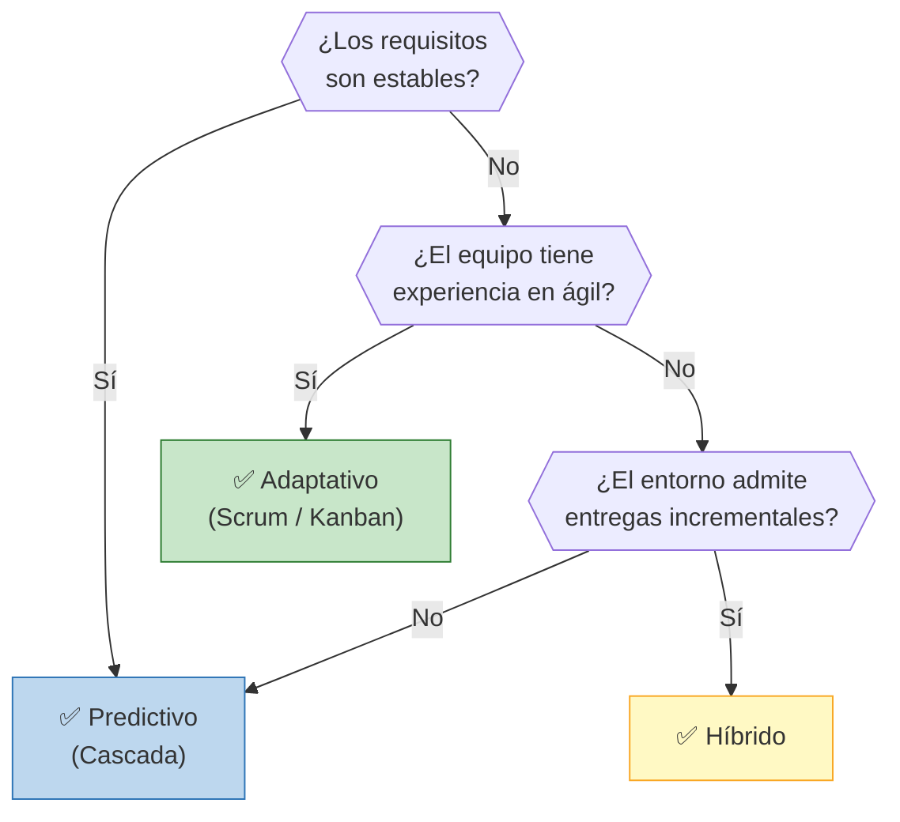
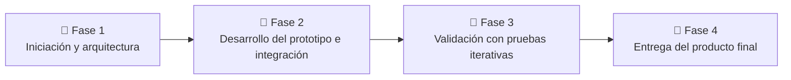

# 🔄 Ciclo de Vida del Proyecto

## Enfoque seleccionado

**Híbrido**

## Justificación de la elección

Se selecciona un ciclo de vida híbrido debido a que el proyecto presenta componentes con requisitos relativamente estables y planificables, como la arquitectura general y el desarrollo del hardware, combinados con aspectos que presentan mayor incertidumbre, principalmente la interacción mediante voz, la experiencia de usuario y la integración con el sistema de gestión existente. Por este motivo, se propone una planificación de carácter predictivo, complementada con un enfoque adaptativo e iterativo durante el desarrollo, integración y validación del prototipo. Esto permitirá incorporar los resultados de las pruebas y la retroalimentación de los usuarios sin perder el control sobre el alcance, los tiempos y los recursos del proyecto.

## Árbol de decisión

**Decisión del grupo:** Siguiendo el árbol de decisión, se parte del análisis de la estabilidad de los requisitos. En nuestro caso, se identifican tanto requisitos estables como aspectos sujetos a cambios y validación durante el desarrollo. Por este motivo, el camino seleccionado conduce a un ciclo de vida híbrido.

Esta decisión permite separar las actividades de enfoque predictivo de aquellas que exigen un enfoque adaptativo. Para estas últimas, debido a la necesidad de entregas incrementales y al desarrollo de funcionalidades de voz y experiencia de usuario, se seleccionó Scrum como marco de trabajo. Esto facilitará un proceso iterativo de ajuste continuo basado en pruebas y realimentación.

Scrum permite organizar el trabajo en sprints, obteniendo al final de cada uno un incremento funcional que puede ser probado y evaluado. Esto resulta adecuado para JARVIS, ya que permite validar progresivamente y de manera constante las funcionalidades y utilizar los resultados obtenidos para ajustar el trabajo de los siguientes sprints.

Además, la posibilidad de mantener una lista de tareas priorizada permite abordar primero las funcionalidades de mayor valor y adaptar el desarrollo a medida que aparecen nuevos requerimientos o se obtiene retroalimentación de los usuarios. De esta forma, Scrum brinda la flexibilidad necesaria para gestionar la incertidumbre de esta parte del proyecto, manteniendo al mismo tiempo una estructura y un seguimiento periódico del avance.

## Fases del proyecto

| Fase | Nombre | Objetivo | Criterio de salida |
| ---- | ----------- | ----------- | ----------------- |
| 1    | Iniciación y arquitectura | Definir requisitos, casos de uso y arquitectura del hardware y software del asistente. | Requisitos y arquitectura documentados. |
| 2    | Desarrollo del prototipo e integración | Diseñar y desarrollar el hardware y firmware del dispositivo y sus componentes principales, con los requisitos definidos anteriormente. Integrar el asistente con el sistema de gestión. | Obtención del prototipo integrado al software. |
| 3    | Validación con pruebas iterativas | Validar/modificar los casos de uso. | Pruebas satisfactorias de validación. |
| 4    | Entrega del producto final | Documentar y presentar al sponsor los resultados. | Entrega final del dispositivo validado e informe de cierre. |

---

*Cátedra Gestión de Proyectos · FIUNER · 2026*
