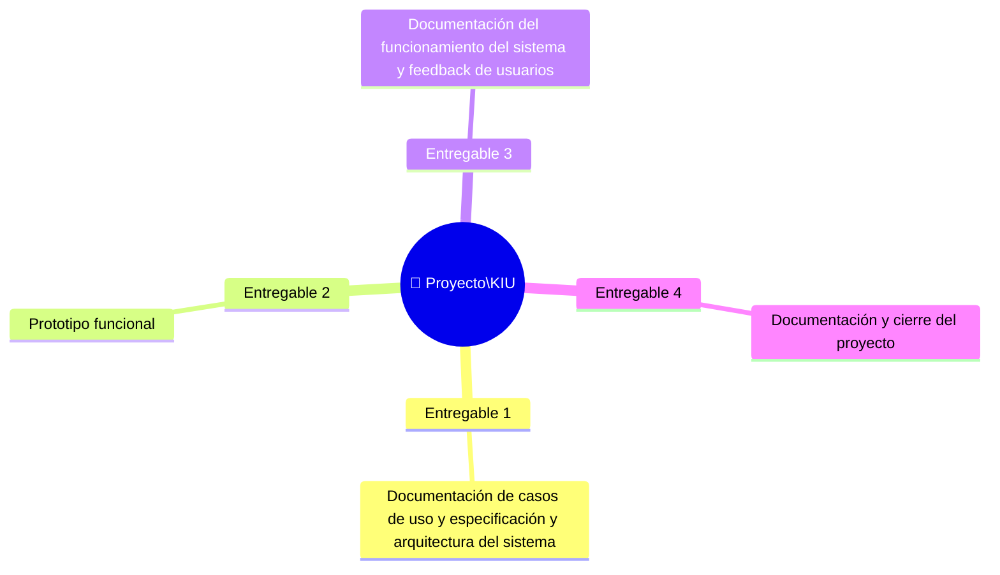

# 📦 Entregables Principales del Proyecto

## Lista de entregables

## Detalle de entregables

| # | Entregable | Descripción | Responsable | Criterio de aceptación |
|---|-----------|-------------|------------|------------------------|
| 1 | Documentación de casos de uso y especificación y arquitectura del sistema | Definición de los requisitos, casos de uso y arquitectura general de KIU, contemplando los componentes de hardware, firmware y comunicación con el sistema de gestión. | Manuela Calvo | Los requisitos y casos de uso están documentados y la arquitectura propuesta se encuentra definida y aprobada por el equipo. |
| 2 | Prototipo funcional | Desarrollo del prototipo físico, incluyendo los componentes de hardware, sistema de audio, comunicaciones, firmware necesarios para la interacción mediante voz e integración con KIBBO. | Josefina Giorgi / Joaquín Machado | El prototipo permite capturar comandos de voz, procesarlos y establecer la comunicación necesaria entre sus componentes y con el software. |
| 3 | Documentación del funcionamiento del sistema y feedback de usuarios | Validación de los casos de uso prioritarios mediante pruebas funcionales. | Joaquín Machado | Los casos de uso prioritarios funcionan correctamente. |
| 4 | Documentación y cierre del proyecto | Elaboración de la documentación técnica y de usuario, resultados de las pruebas, conclusiones y presentación final del proyecto. | Manuela Calvo | La documentación se encuentra completa y permite comprender, configurar, utilizar y evaluar el sistema desarrollado. |

---

*Cátedra Gestión de Proyectos · FIUNER · 2026*
