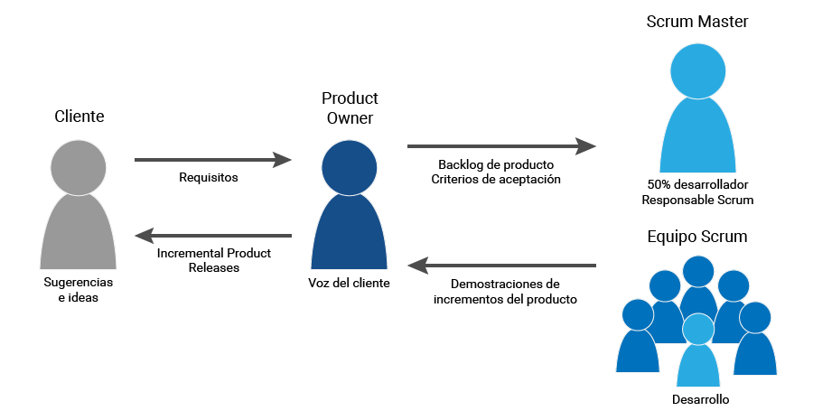

# 🏢 Organización del Proyecto

## Usuarios e interesados (Stakeholders)

| Nombre / Rol                                                                            | Área                           | Interés en el proyecto                                                                                                                      | Influencia |
| --------------------------------------------------------------------------------------- | ------------------------------ | ------------------------------------------------------------------------------------------------------------------------------------------- | ---------- |
| **KIBBO** | Dirección / Tecnología| Incorporar JARVIS a su plataforma, aumentar el valor percibido del software y generar una ventaja competitiva.                              | Alta       |
| **Responsable del Servicio de Ingeniería Clínica** | Servicio de Ingeniería Clínica | Mejorar la productividad, reducir la carga administrativa y asegurar que la solución se adapte al flujo de trabajo del servicio.| Alta       |
| **Ingeniero Clínico / Técnico** | Servicio de Ingeniería Clínica | Disponer de una herramienta que facilite el registro de información, la consulta de actividades y la asistencia durante las intervenciones. | Alta|
| **Institución de Salud**  | Servicios de Salud| Mejorar la disponibilidad, trazabilidad y gestión de la tecnología médica.| Alta |
| **Área de Sistemas / TI**| Tecnología / Sistemas| Asegurar la integración, disponibilidad, seguridad y mantenimiento de la solución tecnológica.| Media|
| **Clientes de KIBBO** | Servicios de Salud | Reducir el esfuerzo administrativo y mejorar la fluidez de las tareas de gestión y mantenimiento.| Media|

## Áreas involucradas

* **Dirección / Tecnología de KIBBO:** patrocinio, definición de objetivos y toma de decisiones de alto nivel.
* **Servicio de Ingeniería Clínica:** definición y validación de los procesos y necesidades funcionales.
* **Desarrollo de hardware:** diseño, selección e integración de los componentes físicos del dispositivo.
* **Desarrollo de firmware/software:** desarrollo del firmware, lógica de funcionamiento e integración con el software de gestión.
* **Sistemas / TI:** soporte relacionado con infraestructura, comunicaciones, seguridad e integración tecnológica.
* **Usuarios finales:** participación en la validación de funcionalidades, pruebas de usabilidad y evaluación de la solución.

## Roles de la organización del proyecto

| Rol                                    | Responsable / representación                                                 | Responsabilidad                                                                                                                        |
| -------------------------------------- | ---------------------------------------------------------------------------- | -------------------------------------------------------------------------------------------------------------------------------------- |
| **Project Sponsor**| KIBBO| Impulsar el proyecto, proporcionar respaldo institucional y representar los intereses estratégicos de la organización.                 |
| **Product Owner**                      | Manuela Calvo | Maximizar el valor del producto, definir y priorizar las funcionalidades y representar las necesidades de los stakeholders y usuarios. |
| **Scrum Master**                       | Manuela Calvo                                                                | Facilitar Scrum, acompañar al equipo, eliminar impedimentos y asegurar que el marco de trabajo sea comprendido y aplicado.             |
| **Development Team**                   | Josefina Giorgi + Joaquín Machado                                            | Diseñar, desarrollar, integrar y verificar los incrementos funcionales de JARVIS.                                                      |
| **End Users**                          | Ingenieros clínicos / técnicos de mantenimiento                              | Participar en la definición y validación de funcionalidades, pruebas de usabilidad y evaluación del funcionamiento de la solución.     |

## Estructura del equipo

---

*Cátedra Gestión de Proyectos · FIUNER · 2026*
