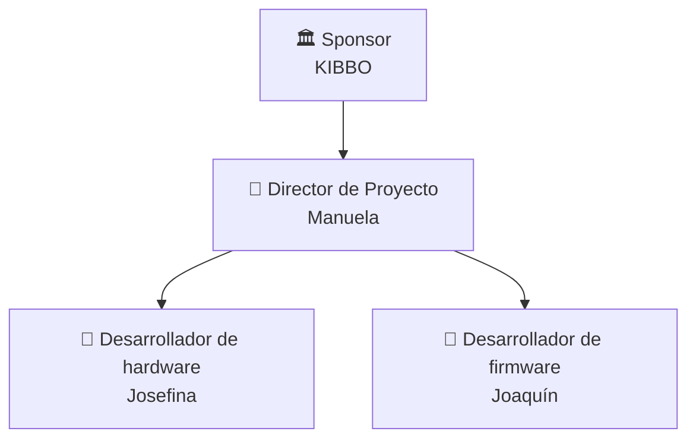

# 🏢 Organización del Proyecto

## Usuarios e interesados (Stakeholders)

| Nombre / Rol | Área | Interés en el proyecto | Influencia |
|--------------|------|------------------------|-----------|
| Ingeniero Clínico | Servicio de Ingeniería Clínica | Uso del dispositivo | Alta |
| Institucion de Salud | Servicios de Salud | Disponibilidad y seguridad de la tecnología médica | Alta |
| Empresa de software de gestión | Tecnología | Aumento/disminución del uso de su producto | Alta |

## Áreas involucradas

- [COMPLETAR]

## Equipo del proyecto

| Integrante | Rol en el proyecto | Responsabilidad principal |
|------------|--------------------|--------------------------|
| Manuela Calvo | Director / Líder de Proyecto | Comunicarse con stakeholders y dirigir  y guiar las etapas del proyecto |
| Josefina Giorgi | Desarrollador de hardware | Compras, diseño y desarrollo del hardware |
| Joaquin Machado | Desarrollador de firmware | Diseño y desarrollo del firmware |

## Estructura del equipo

---

*Cátedra Gestión de Proyectos · FIUNER · 2026*
