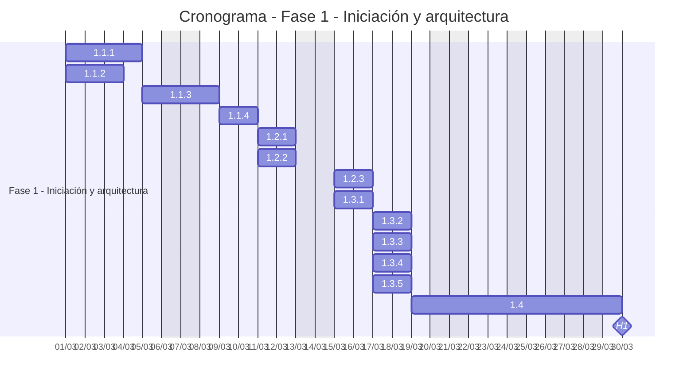
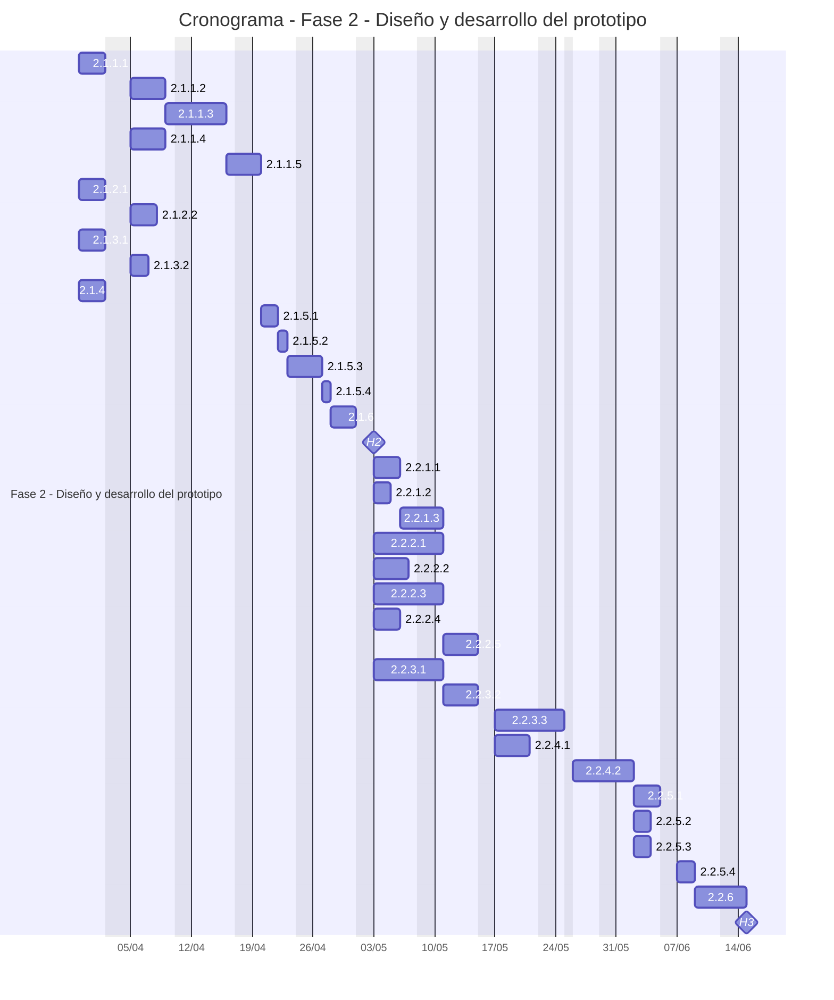
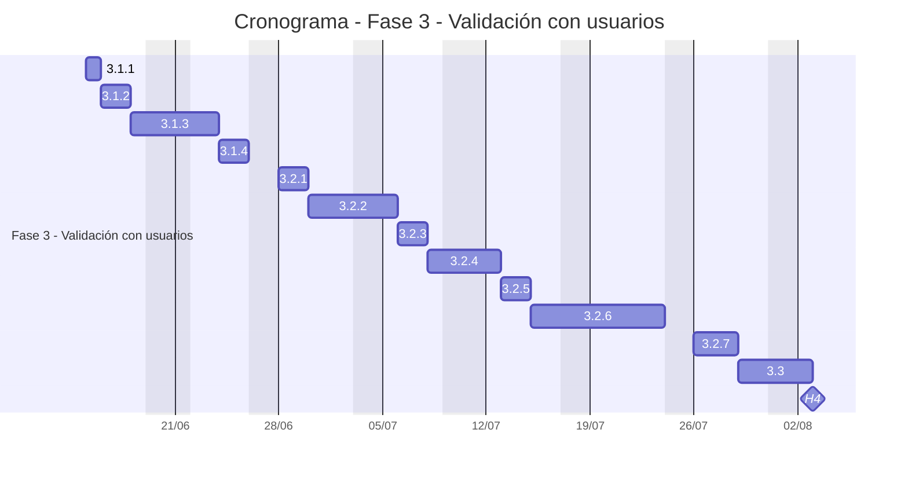
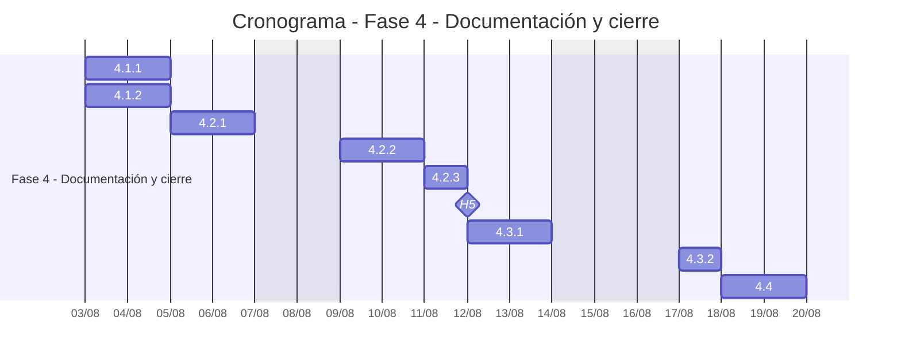

# 📅 Cronograma del Proyecto

## Diagrama de Gantt

## Tabla de tareas
| ID | Tarea | Predecesoras | Esfuerzo (horas-persona) | Duración (días) | Inicio | Fin | Hito |
| --- | --- | --- | --- | --- | --- | --- | --- |
| 1.1.1 | Relevamiento con técnicos del SIC | — | 28 | 4 | 01/03/2027 | 04/03/2027 | No |
| 1.1.2 | Analizar el software KIBBO y su interfaz MCP | — | 20 | 3 | 01/03/2027 | 03/03/2027 | No |
| 1.1.3 | Elaborar el documento de casos de uso iniciales | 1.1.1, 1.1.2 | 16 | 2 | 05/03/2027 | 08/03/2027 | No |
| 1.1.4 | Priorización de casos de uso y definición del alcance del prototipo | 1.1.3 | 11 | 2 | 09/03/2027 | 10/03/2027 | No |
| 1.2.1 | Definir requisitos funcionales | 1.1.4 | 15 | 2 | 11/03/2027 | 12/03/2027 | No |
| 1.2.2 | Definir requisitos no funcionales | 1.1.4 | 13 | 2 | 11/03/2027 | 12/03/2027 | No |
| 1.2.3 | Elaborar la matriz de trazabilidad | 1.2.1, 1.2.2 | 9 | 2 | 15/03/2027 | 16/03/2027 | No |
| 1.3.1 | Definición de arquitectura general e interfaces | 1.2.1, 1.2.2 | 16 | 2 | 15/03/2027 | 16/03/2027 | No |
| 1.3.2 | Definición de arquitectura de hardware | 1.3.1 | 12 | 2 | 17/03/2027 | 18/03/2027 | No |
| 1.3.3 | Definición de arquitectura de firmware | 1.3.1 | 12 | 2 | 17/03/2027 | 18/03/2027 | No |
| 1.3.4 | Definición de arquitectura de servicios en la nube | 1.3.1 | 15 | 2 | 17/03/2027 | 18/03/2027 | No |
| 1.3.5 | Definición de arquitectura de seguridad | 1.3.1 | 14 | 2 | 17/03/2027 | 18/03/2027 | No |
| 1.4 | Evaluación y selección de proveedores de STT/LLM/TTS | 1.3.4 | 34 | 5 | 19/03/2027 | 29/03/2027 | No |
| H1 | 🏁 Fin de la fase 1 | 1.2.3, 1.3.2, 1.3.3, 1.3.5, 1.4 | — | 0 | 29/03/2027 | 29/03/2027 | **Sí** |
| 2.1.1.1 | Selección de componentes | H1 | 19 | 3 | 30/03/2027 | 01/04/2027 | No |
| 2.1.1.2 | Diseño esquemático | 2.1.1.1 | 29 | 4 | 05/04/2027 | 08/04/2027 | No |
| 2.1.1.3 | Diseño de PCB | 2.1.1.2 | 40 | 5 | 09/04/2027 | 15/04/2027 | No |
| 2.1.1.4 | Diseño del gabinete | 2.1.1.1 | 27 | 4 | 05/04/2027 | 08/04/2027 | No |
| 2.1.1.5 | Generación de lista de materiales y calcular el costo unitario | 2.1.1.3, 2.1.1.4 | 9 | 2 | 16/04/2027 | 19/04/2027 | No |
| 2.1.2.1 | Diseño de módulos | H1 | 19 | 3 | 30/03/2027 | 01/04/2027 | No |
| 2.1.2.2 | Diseño de comunicación dispositivo-backend | 2.1.2.1 | 17 | 3 | 05/04/2027 | 07/04/2027 | No |
| 2.1.3.1 | Diseño de flujos conversacionales por caso de uso priorizado | H1 | 22 | 3 | 30/03/2027 | 01/04/2027 | No |
| 2.1.3.2 | Diseño de integración con MCP de KIBBO | 2.1.3.1 | 16 | 2 | 05/04/2027 | 06/04/2027 | No |
| 2.1.4 | Elaborar el plan de verificación técnica | H1, 1.2.3 | 19 | 3 | 30/03/2027 | 01/04/2027 | No |
| 2.1.5.1 | Solicitar cotizaciones y selección de proveedores | 2.1.1.5 | 9 | 2 | 20/04/2027 | 21/04/2027 | No |
| 2.1.5.2 | Generación de órdenes de compra | 2.1.5.1 | 5 | 1 | 22/04/2027 | 22/04/2027 | No |
| 2.1.5.3 | Realizar el seguimiento de envío e importación | 2.1.5.2 | 11 | 2 | 23/04/2027 | 26/04/2027 | No |
| 2.1.5.4 | Recepción e inspección de componentes | 2.1.5.3 | 7 | 1 | 27/04/2027 | 27/04/2027 | No |
| 2.1.6 | Revisión de diseño | 2.1.1.5, 2.1.2.2, 2.1.3.2, 2.1.4, 2.1.5.4 | 20 | 3 | 28/04/2027 | 30/04/2027 | No |
| H2 | 🏁 Revisión de diseño aprobada | 2.1.6 | — | 0 | 30/04/2027 | 30/04/2027 | **Sí** |
| 2.2.1.1 | Fabricación y montaje de PCB | H2 | 21 | 3 | 03/05/2027 | 05/05/2027 | No |
| 2.2.1.2 | Fabricación del gabinete | H2 | 12 | 2 | 03/05/2027 | 04/05/2027 | No |
| 2.2.1.3 | Ensamble del dispositivo y pruebas eléctricas | 2.2.1.1, 2.2.1.2 | 17 | 3 | 06/05/2027 | 10/05/2027 | No |
| 2.2.2.1 | Implementación de captura y preprocesamiento de audio | H2 | 45 | 6 | 03/05/2027 | 10/05/2027 | No |
| 2.2.2.2 | Implementación de activación y gestión de estados | H2 | 32 | 4 | 03/05/2027 | 06/05/2027 | No |
| 2.2.2.3 | Implementación de conectividad y mecanismos de seguridad | H2 | 43 | 6 | 03/05/2027 | 10/05/2027 | No |
| 2.2.2.4 | Implementación de la reproducción de audio | H2 | 23 | 3 | 03/05/2027 | 05/05/2027 | No |
| 2.2.2.5 | Ejecutar pruebas unitarias del firmware | 2.2.2.1, 2.2.2.2, 2.2.2.3, 2.2.2.4 | 29 | 4 | 11/05/2027 | 14/05/2027 | No |
| 2.2.3.1 | Integrar STT, intérprete y TTS | H2 | 47 | 6 | 03/05/2027 | 10/05/2027 | No |
| 2.2.3.2 | Integración MCP con KIBBO | H2, 2.2.3.1 | 31 | 4 | 11/05/2027 | 14/05/2027 | No |
| 2.2.3.3 | Implementación de los casos de uso priorizados | 2.2.3.1, 2.2.3.2 | 46 | 6 | 17/05/2027 | 24/05/2027 | No |
| 2.2.4.1 | Integración de hardware con firmware | 2.2.1.3, 2.2.2.5 | 26 | 4 | 17/05/2027 | 20/05/2027 | No |
| 2.2.4.2 | Integración del dispositivo con la nube y KIBBO (integración punta a punta) | 2.2.4.1, 2.2.3.3 | 37 | 5 | 26/05/2027 | 01/06/2027 | No |
| 2.2.5.1 | Ejecutar ensayos de reconocimiento de voz con ruido y a distancia | 2.2.4.2 | 22 | 3 | 02/06/2027 | 04/06/2027 | No |
| 2.2.5.2 | Ejecutar ensayos de latencia y conectividad | 2.2.4.2 | 15 | 2 | 02/06/2027 | 03/06/2027 | No |
| 2.2.5.3 | Ejecutar ensayos de seguridad | 2.2.4.2 | 16 | 2 | 02/06/2027 | 03/06/2027 | No |
| 2.2.5.4 | Elaborar informe de verificación técnica | 2.2.5.1, 2.2.5.2, 2.2.5.3 | 13 | 2 | 07/06/2027 | 08/06/2027 | No |
| 2.2.6 | Redacción de manual técnico y manual de usuario | 2.2.5.4 | 29 | 4 | 09/06/2027 | 14/06/2027 | No |
| H3 | 🏁 Fin de desarrollo y verificación | 2.2.6 | — | 0 | 14/06/2027 | 14/06/2027 | **Sí** |
| 3.1.1 | Selección de los casos de uso a validar | H3 | 5 | 1 | 15/06/2027 | 15/06/2027 | No |
| 3.1.2 | Definición de instrumentos de feedback | 3.1.1 | 12 | 2 | 16/06/2027 | 17/06/2027 | No |
| 3.1.3 | Definición de casos de prueba y criterios de aceptación | 3.1.2 | 17 | 3 | 18/06/2027 | 23/06/2027 | No |
| 3.1.4 | Coordinación del piloto con un SIC | 3.1.3 | 11 | 2 | 24/06/2027 | 25/06/2027 | No |
| 3.2.1 | Ejecutar pruebas funcionales de casos de uso | 3.1.4 | 15 | 2 | 28/06/2027 | 29/06/2027 | No |
| 3.2.2 | Ejecutar pruebas piloto con técnicos | 3.2.1 | 25 | 4 | 30/06/2027 | 05/07/2027 | No |
| 3.2.3 | Registro de defectos, feedback y necesidades no cubiertas | 3.2.2 | 11 | 2 | 06/07/2027 | 07/07/2027 | No |
| 3.2.4 | Identificación y especificación de nuevos casos de uso | 3.2.3 | 12 | 2 | 08/07/2027 | 12/07/2027 | No |
| 3.2.5 | Priorización de nuevos casos de uso y solicitud de cambio a KIBBO | 3.2.4 | 9 | 2 | 13/07/2027 | 14/07/2027 | No |
| 3.2.6 | Ajuste del producto (hardware, firmware y nube) | 3.2.5 | 52 | 7 | 15/07/2027 | 23/07/2027 | No |
| 3.2.7 | Ejecutar las pruebas de regresión | 3.2.6 | 17 | 3 | 26/07/2027 | 28/07/2027 | No |
| 3.3 | Informe de validación y feedback de usuarios | 3.2.7 | 17 | 3 | 29/07/2027 | 02/08/2027 | No |
| H4 | 🏁 Validación finalizada | 3.3 | — | 0 | 02/08/2027 | 02/08/2027 | **Sí** |
| 4.1.1 | Elaborar el informe final de pruebas | H4 | 14 | 2 | 03/08/2027 | 04/08/2027 | No |
| 4.1.2 | Registro de problemas presentados y soluciones | H4 | 9 | 2 | 03/08/2027 | 04/08/2027 | No |
| 4.2.1 | Entrega del prototipo y los repositorios | 4.1.1, 4.1.2 | 9 | 2 | 05/08/2027 | 06/08/2027 | No |
| 4.2.2 | Realizar la demostración y capacitación | 4.2.1 | 14 | 2 | 09/08/2027 | 10/08/2027 | No |
| 4.2.3 | Elaborar el acta de aceptación | 4.2.2 | 5 | 1 | 11/08/2027 | 11/08/2027 | No |
| H5 | 🏁 Prototipo aceptado | 4.2.3 | — | 0 | 11/08/2027 | 11/08/2027 | **Sí** |
| 4.3.1 | Análisis de desviaciones de alcance, tiempo y costo | H5 | 12 | 2 | 12/08/2027 | 13/08/2027 | No |
| 4.3.2 | Archivar la documentación del proyecto | 4.3.1 | 7 | 1 | 17/08/2027 | 17/08/2027 | No |
| 4.4 | Realizar la presentación final y reunión de cierre | 4.3.2 | 15 | 2 | 18/08/2027 | 19/08/2027 | No |
---

*Cátedra Gestión de Proyectos · FIUNER · 2026*
