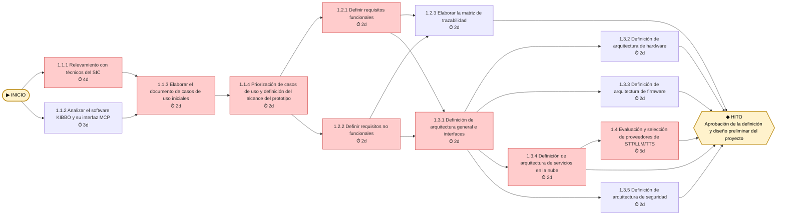

# 🔗 Red de Tareas y Camino Crítico

## Diagrama de precedencias

> Las tareas del **Camino Crítico** se muestran en rojo (holgura = 0).

### Fase 1: Iniciación y arquitectura

### Fase 2: Diseño y desarrollo del prototipo

```mermaid
flowchart LR
    H1{{"◆ HITO\nAprobación de la definición y diseño preliminar del proyecto"}}

    T2111["2.1.1.1 Selección de componentes\n⏱ 3d"]
    T2112["2.1.1.2 Diseño esquemático\n⏱ 4d"]
    T2113["2.1.1.3 Diseño de PCB\n⏱ 5d"]
    T2114["2.1.1.4 Diseño del gabinete\n⏱ 4d"]
    T2115["2.1.1.5 Generación de lista de materiales y calcular el costo unitario\n⏱ 2d"]

    T2121["2.1.2.1 Diseño de módulos\n⏱ 3d"]
    T2122["2.1.2.2 Diseño de comunicación dispositivo-backend\n⏱ 3d"]

    T2131["2.1.3.1 Diseño de flujos conversacionales por caso de uso priorizado\n⏱ 3d"]
    T2132["2.1.3.2 Integración con MCP de KIBBO\n⏱ 2d"]

    T214["2.1.4 Elaborar el plan de verificación técnica\n⏱ 3d"]

    T2151["2.1.5.1 Solicitar cotizaciones y selección de proveedores\n⏱ 2d"]
    T2152["2.1.5.2 Generación de órdenes de compra\n⏱ 1d"]
    T2153["2.1.5.3 Realizar el seguimiento de envío e importación\n⏱ 2d"]
    T2154["2.1.5.4 Recepción e inspección de componentes\n⏱ 1d"]

    T216["2.1.6 Revisión de diseño\n⏱ 3d"]

    H2{{"◆ HITO\nDiseño aprobado y componentes recibidos"}}

    T2211["2.2.1.1 Fabricación y montaje de PCB\n⏱ 3d"]
    T2212["2.2.1.2 Fabricación del gabinete\n⏱ 2d"]
    T2213["2.2.1.3 Ensamble del dispositivo y pruebas eléctricas\n⏱ 3d"]

    T2221["2.2.2.1 Implementación de captura y preprocesamiento de audio\n⏱ 6d"]
    T2222["2.2.2.2 Implementación de activación y gestión de estados\n⏱ 4d"]
    T2223["2.2.2.3 Implementación de conectividad y mecanismos de seguridad\n⏱ 6d"]
    T2224["2.2.2.4 Implementación de la reproducción de audio\n⏱ 3d"]
    T2225["2.2.2.5 Ejecutar pruebas unitarias del firmware\n⏱ 4d"]

    T2231["2.2.3.1 Integrar STT, intérprete y TTS\n⏱ 6d"]
    T2232["2.2.3.2 Integración MCP con KIBBO\n⏱ 4d"]
    T2233["2.2.3.3 Implementación de los casos de uso priorizados\n⏱ 6d"]

    T2241["2.2.4.1 Integración de hardware con firmware\n⏱ 4d"]
    T2242["2.2.4.2 Integración del dispositivo con la nube y KIBBO (integración punta a punta)\n⏱ 5d"]

    T2251["2.2.5.1 Ejecutar ensayos de reconocimiento de voz con ruido y a distancia\n⏱ 3d"]
    T2252["2.2.5.2 Ejecutar ensayos de latencia y conectividad\n⏱ 2d"]
    T2253["2.2.5.3 Ejecutar ensayos de seguridad\n⏱ 2d"]
    T2254["2.2.5.4 Elaborar informe de verificación técnica\n⏱ 2d"]

    T226["2.2.6 Redacción de manual técnico y manual de usuario\n⏱ 4d"]

    H3{{"◆ HITO\nPrototipo funcional verificado"}}

    H1 --> T2111
    T2111 --> T2112
    T2112 --> T2113
    T2111 --> T2114
    T2113 --> T2115
    T2114 --> T2115

    H1 --> T2121
    T2121 --> T2122

    H1 --> T2131
    T2131 --> T2132

    H1 --> T214

    T2115 --> T2151
    T2151 --> T2152
    T2152 --> T2153
    T2153 --> T2154

    T2115 --> T216
    T2122 --> T216
    T2132 --> T216
    T214 --> T216
    T2154 --> T216

    T216 --> H2

    H2 --> T2211
    H2 --> T2212
    T2211 --> T2213
    T2212 --> T2213

    H2 --> T2221
    H2 --> T2222
    H2 --> T2223
    H2 --> T2224

    T2221 --> T2225
    T2222 --> T2225
    T2223 --> T2225
    T2224 --> T2225

    H2 --> T2231
    H2 --> T2232
    T2231 --> T2232
    T2231 --> T2233
    T2232 --> T2233

    T2213 --> T2241
    T2225 --> T2241

    T2241 --> T2242
    T2233 --> T2242

    T2242 --> T2251
    T2242 --> T2252
    T2242 --> T2253

    T2251 --> T2254
    T2252 --> T2254
    T2253 --> T2254

    T2254 --> T226
    T226 --> H3

    classDef hito fill:#FFF2CC,stroke:#B8860B,stroke-width:2px,color:#000000
    class H1,H2,H3 hito

    style T2111 fill:#FFCCCC,stroke:#C62828
    style T2112 fill:#FFCCCC,stroke:#C62828
    style T2113 fill:#FFCCCC,stroke:#C62828
    style T2115 fill:#FFCCCC,stroke:#C62828
    style T2151 fill:#FFCCCC,stroke:#C62828
    style T2152 fill:#FFCCCC,stroke:#C62828
    style T2153 fill:#FFCCCC,stroke:#C62828
    style T2154 fill:#FFCCCC,stroke:#C62828
    style T216 fill:#FFCCCC,stroke:#C62828
    style T2231 fill:#FFCCCC,stroke:#C62828
    style T2232 fill:#FFCCCC,stroke:#C62828
    style T2233 fill:#FFCCCC,stroke:#C62828
    style T2242 fill:#FFCCCC,stroke:#C62828
    style T2251 fill:#FFCCCC,stroke:#C62828
    style T2254 fill:#FFCCCC,stroke:#C62828
    style T226 fill:#FFCCCC,stroke:#C62828
```

### Fase 3: Validación con usuarios

```mermaid
flowchart LR
    H3{{"◆ HITO\nPrototipo funcional verificado"}}

    T311["3.1.1 Selección de los casos de uso a validar\n⏱ 1d"]
    T312["3.1.2 Definición de instrumentos de feedback\n⏱ 2d"]
    T313["3.1.3 Definición de casos de prueba y criterios de aceptación\n⏱ 3d"]
    T314["3.1.4 Coordinación del piloto con un SIC\n⏱ 2d"]

    T321["3.2.1 Ejecutar pruebas funcionales de casos de uso\n⏱ 2d"]
    T322["3.2.2 Ejecutar pruebas piloto con técnicos\n⏱ 4d"]
    T323["3.2.3 Registro de defectos, feedback y necesidades no cubiertas\n⏱ 2d"]
    T324["3.2.4 Identificación y especificación de nuevos casos de uso\n⏱ 2d"]
    T325["3.2.5 Priorización de nuevos casos de uso y solicitud de cambio a KIBBO\n⏱ 2d"]
    T326["3.2.6 Ajuste del producto (hardware, firmware y nube)\n⏱ 7d"]
    T327["3.2.7 Ejecutar las pruebas de regresión\n⏱ 3d"]

    T33["3.3 Informe de validación y feedback de usuarios\n⏱ 3d"]

    H4{{"◆ HITO\nIteración de validación completada"}}

    H3 --> T311
    T311 --> T312
    T312 --> T313
    T313 --> T314

    T314 --> T321
    T321 --> T322
    T322 --> T323
    T323 --> T324
    T324 --> T325
    T325 --> T326
    T326 --> T327

    T327 --> T33
    T327 -->|"N iteraciones"| T321

    T33 --> H4

    classDef hito fill:#FFF2CC,stroke:#B8860B,stroke-width:2px,color:#000000
    class H3,H4 hito

    style T311 fill:#FFCCCC,stroke:#C62828
    style T312 fill:#FFCCCC,stroke:#C62828
    style T313 fill:#FFCCCC,stroke:#C62828
    style T314 fill:#FFCCCC,stroke:#C62828
    style T321 fill:#FFCCCC,stroke:#C62828
    style T322 fill:#FFCCCC,stroke:#C62828
    style T323 fill:#FFCCCC,stroke:#C62828
    style T324 fill:#FFCCCC,stroke:#C62828
    style T325 fill:#FFCCCC,stroke:#C62828
    style T326 fill:#FFCCCC,stroke:#C62828
    style T327 fill:#FFCCCC,stroke:#C62828
    style T33 fill:#FFCCCC,stroke:#C62828
```

### Fase 4: Documentación y cierre

```mermaid
flowchart LR
    H4{{"◆ HITO\nIteración de validación completada"}}

    T411["4.1.1 Elaborar el informe final de pruebas\n⏱ 2d"]
    T412["4.1.2 Registro de problemas presentados y soluciones\n⏱ 2d"]

    T421["4.2.1 Entrega del prototipo y los repositorios\n⏱ 2d"]
    T422["4.2.2 Realizar la demostración y capacitación\n⏱ 2d"]
    T423["4.2.3 Elaborar el acta de aceptación\n⏱ 1d"]

    H5{{"◆ HITO\nActa de aceptación firmada"}}

    T431["4.3.1 Análisis de desviaciones de alcance, tiempo y costo\n⏱ 2d"]
    T432["4.3.2 Archivar la documentación del proyecto\n⏱ 1d"]
    T44["4.4 Realizar la presentación final y reunión de cierre\n⏱ 2d"]

    END(["⏹ FIN"])

    H4 --> T411
    H4 --> T412

    T411 --> T421
    T412 --> T421

    T421 --> T422
    T422 --> T423

    T423 --> H5

    H5 --> T431
    T431 --> T432
    T432 --> T44

    T44 --> END

    classDef hito fill:#FFF2CC,stroke:#B8860B,stroke-width:2px,color:#000000
    class H4,H5,END hito

    style T411 fill:#FFCCCC,stroke:#C62828
    style T412 fill:#FFCCCC,stroke:#C62828
    style T421 fill:#FFCCCC,stroke:#C62828
    style T422 fill:#FFCCCC,stroke:#C62828
    style T423 fill:#FFCCCC,stroke:#C62828
    style T431 fill:#FFCCCC,stroke:#C62828
    style T432 fill:#FFCCCC,stroke:#C62828
    style T44 fill:#FFCCCC,stroke:#C62828
```

## Análisis del Camino Crítico
| ID | Tarea | Inicio Temprano | Fin Temprano | Inicio Tardío | Fin Tardío | Holgura | ¿Crítica? |
|----|-------|:-:|:-:|:-:|:-:|:-:|:-:|
| 1.1.1 | Relevamiento con técnicos del SIC | 01/03/2027 | 04/03/2027 | 01/03/2027 | 04/03/2027 | 0 | ✅ |
| 1.1.2 | Analizar el software KIBBO y su interfaz MCP | 01/03/2027 | 03/03/2027 | 02/03/2027 | 04/03/2027 | 1 | ❌ |
| 1.1.3 | Elaborar el documento de casos de uso iniciales | 05/03/2027 | 08/03/2027 | 05/03/2027 | 08/03/2027 | 0 | ✅ |
| 1.1.4 | Priorización de casos de uso y definición del alcance del prototipo | 09/03/2027 | 10/03/2027 | 09/03/2027 | 10/03/2027 | 0 | ✅ |
| 1.2.1 | Definir requisitos funcionales | 11/03/2027 | 12/03/2027 | 11/03/2027 | 12/03/2027 | 0 | ✅ |
| 1.2.2 | Definir requisitos no funcionales | 11/03/2027 | 12/03/2027 | 11/03/2027 | 12/03/2027 | 0 | ✅ |
| 1.2.3 | Elaborar la matriz de trazabilidad | 15/03/2027 | 16/03/2027 | 25/03/2027 | 29/03/2027 | 7 | ❌ |
| 1.3.1 | Definición de arquitectura general e interfaces | 15/03/2027 | 16/03/2027 | 15/03/2027 | 16/03/2027 | 0 | ✅ |
| 1.3.2 | Definición de arquitectura de hardware | 17/03/2027 | 18/03/2027 | 25/03/2027 | 29/03/2027 | 5 | ❌ |
| 1.3.3 | Definición de arquitectura de firmware | 17/03/2027 | 18/03/2027 | 25/03/2027 | 29/03/2027 | 5 | ❌ |
| 1.3.4 | Definición de arquitectura de servicios en la nube | 17/03/2027 | 18/03/2027 | 17/03/2027 | 18/03/2027 | 0 | ✅ |
| 1.3.5 | Definición de arquitectura de seguridad | 17/03/2027 | 18/03/2027 | 25/03/2027 | 29/03/2027 | 5 | ❌ |
| 1.4 | Evaluación y selección de proveedores de STT/LLM/TTS | 19/03/2027 | 29/03/2027 | 19/03/2027 | 29/03/2027 | 0 | ✅ |
| H1 | 🏁 Fin de la fase 1 | 29/03/2027 | 29/03/2027 | 29/03/2027 | 29/03/2027 | 0 | ✅ |
| 2.1.1.1 | Selección de componentes | 30/03/2027 | 01/04/2027 | 30/03/2027 | 01/04/2027 | 0 | ✅ |
| 2.1.1.2 | Diseño esquemático | 05/04/2027 | 08/04/2027 | 05/04/2027 | 08/04/2027 | 0 | ✅ |
| 2.1.1.3 | Diseño de PCB | 09/04/2027 | 15/04/2027 | 09/04/2027 | 15/04/2027 | 0 | ✅ |
| 2.1.1.4 | Diseño del gabinete | 05/04/2027 | 08/04/2027 | 12/04/2027 | 15/04/2027 | 5 | ❌ |
| 2.1.1.5 | Generación de lista de materiales y calcular el costo unitario | 16/04/2027 | 19/04/2027 | 16/04/2027 | 19/04/2027 | 0 | ✅ |
| 2.1.2.1 | Diseño de módulos | 30/03/2027 | 01/04/2027 | 20/04/2027 | 22/04/2027 | 14 | ❌ |
| 2.1.2.2 | Diseño de comunicación dispositivo-backend | 05/04/2027 | 07/04/2027 | 23/04/2027 | 27/04/2027 | 14 | ❌ |
| 2.1.3.1 | Diseño de flujos conversacionales por caso de uso priorizado | 30/03/2027 | 01/04/2027 | 21/04/2027 | 23/04/2027 | 15 | ❌ |
| 2.1.3.2 | Diseño de integración con MCP de KIBBO | 05/04/2027 | 06/04/2027 | 26/04/2027 | 27/04/2027 | 15 | ❌ |
| 2.1.4 | Elaborar el plan de verificación técnica | 30/03/2027 | 01/04/2027 | 23/04/2027 | 27/04/2027 | 17 | ❌ |
| 2.1.5.1 | Solicitar cotizaciones y selección de proveedores | 20/04/2027 | 21/04/2027 | 20/04/2027 | 21/04/2027 | 0 | ✅ |
| 2.1.5.2 | Generación de órdenes de compra | 22/04/2027 | 22/04/2027 | 22/04/2027 | 22/04/2027 | 0 | ✅ |
| 2.1.5.3 | Realizar el seguimiento de envío e importación | 23/04/2027 | 26/04/2027 | 23/04/2027 | 26/04/2027 | 0 | ✅ |
| 2.1.5.4 | Recepción e inspección de componentes | 27/04/2027 | 27/04/2027 | 27/04/2027 | 27/04/2027 | 0 | ✅ |
| 2.1.6 | Revisión de diseño | 28/04/2027 | 30/04/2027 | 28/04/2027 | 30/04/2027 | 0 | ✅ |
| H2 | 🏁 Revisión de diseño aprobada | 30/04/2027 | 30/04/2027 | 30/04/2027 | 30/04/2027 | 0 | ✅ |
| 2.2.1.1 | Fabricación y montaje de PCB | 03/05/2027 | 05/05/2027 | 11/05/2027 | 13/05/2027 | 6 | ❌ |
| 2.2.1.2 | Fabricación del gabinete | 03/05/2027 | 04/05/2027 | 12/05/2027 | 13/05/2027 | 7 | ❌ |
| 2.2.1.3 | Ensamble del dispositivo y pruebas eléctricas | 06/05/2027 | 10/05/2027 | 14/05/2027 | 18/05/2027 | 6 | ❌ |
| 2.2.2.1 | Implementación de captura y preprocesamiento de audio | 03/05/2027 | 10/05/2027 | 05/05/2027 | 12/05/2027 | 2 | ❌ |
| 2.2.2.2 | Implementación de activación y gestión de estados | 03/05/2027 | 06/05/2027 | 07/05/2027 | 12/05/2027 | 4 | ❌ |
| 2.2.2.3 | Implementación de conectividad y mecanismos de seguridad | 03/05/2027 | 10/05/2027 | 05/05/2027 | 12/05/2027 | 2 | ❌ |
| 2.2.2.4 | Implementación de la reproducción de audio | 03/05/2027 | 05/05/2027 | 10/05/2027 | 12/05/2027 | 5 | ❌ |
| 2.2.2.5 | Ejecutar pruebas unitarias del firmware | 11/05/2027 | 14/05/2027 | 13/05/2027 | 18/05/2027 | 2 | ❌ |
| 2.2.3.1 | Integrar STT, intérprete y TTS | 03/05/2027 | 10/05/2027 | 03/05/2027 | 10/05/2027 | 0 | ✅ |
| 2.2.3.2 | Integración MCP con KIBBO | 11/05/2027 | 14/05/2027 | 11/05/2027 | 14/05/2027 | 0 | ✅ |
| 2.2.3.3 | Implementación de los casos de uso priorizados | 17/05/2027 | 24/05/2027 | 17/05/2027 | 24/05/2027 | 0 | ✅ |
| 2.2.4.1 | Integración de hardware con firmware | 17/05/2027 | 20/05/2027 | 19/05/2027 | 24/05/2027 | 2 | ❌ |
| 2.2.4.2 | Integración del dispositivo con la nube y KIBBO (integración punta a punta) | 26/05/2027 | 01/06/2027 | 26/05/2027 | 01/06/2027 | 0 | ✅ |
| 2.2.5.1 | Ejecutar ensayos de reconocimiento de voz con ruido y a distancia | 02/06/2027 | 04/06/2027 | 02/06/2027 | 04/06/2027 | 0 | ✅ |
| 2.2.5.2 | Ejecutar ensayos de latencia y conectividad | 02/06/2027 | 03/06/2027 | 03/06/2027 | 04/06/2027 | 1 | ❌ |
| 2.2.5.3 | Ejecutar ensayos de seguridad | 02/06/2027 | 03/06/2027 | 03/06/2027 | 04/06/2027 | 1 | ❌ |
| 2.2.5.4 | Elaborar informe de verificación técnica | 07/06/2027 | 08/06/2027 | 07/06/2027 | 08/06/2027 | 0 | ✅ |
| 2.2.6 | Redacción de manual técnico y manual de usuario | 09/06/2027 | 14/06/2027 | 09/06/2027 | 14/06/2027 | 0 | ✅ |
| H3 | 🏁 Fin de desarrollo y verificación | 14/06/2027 | 14/06/2027 | 14/06/2027 | 14/06/2027 | 0 | ✅ |
| 3.1.1 | Selección de los casos de uso a validar | 15/06/2027 | 15/06/2027 | 15/06/2027 | 15/06/2027 | 0 | ✅ |
| 3.1.2 | Definición de instrumentos de feedback | 16/06/2027 | 17/06/2027 | 16/06/2027 | 17/06/2027 | 0 | ✅ |
| 3.1.3 | Definición de casos de prueba y criterios de aceptación | 18/06/2027 | 23/06/2027 | 18/06/2027 | 23/06/2027 | 0 | ✅ |
| 3.1.4 | Coordinación del piloto con un SIC | 24/06/2027 | 25/06/2027 | 24/06/2027 | 25/06/2027 | 0 | ✅ |
| 3.2.1 | Ejecutar pruebas funcionales de casos de uso | 28/06/2027 | 29/06/2027 | 28/06/2027 | 29/06/2027 | 0 | ✅ |
| 3.2.2 | Ejecutar pruebas piloto con técnicos | 30/06/2027 | 05/07/2027 | 30/06/2027 | 05/07/2027 | 0 | ✅ |
| 3.2.3 | Registro de defectos, feedback y necesidades no cubiertas | 06/07/2027 | 07/07/2027 | 06/07/2027 | 07/07/2027 | 0 | ✅ |
| 3.2.4 | Identificación y especificación de nuevos casos de uso | 08/07/2027 | 12/07/2027 | 08/07/2027 | 12/07/2027 | 0 | ✅ |
| 3.2.5 | Priorización de nuevos casos de uso y solicitud de cambio a KIBBO | 13/07/2027 | 14/07/2027 | 13/07/2027 | 14/07/2027 | 0 | ✅ |
| 3.2.6 | Ajuste del producto (hardware, firmware y nube) | 15/07/2027 | 23/07/2027 | 15/07/2027 | 23/07/2027 | 0 | ✅ |
| 3.2.7 | Ejecutar las pruebas de regresión | 26/07/2027 | 28/07/2027 | 26/07/2027 | 28/07/2027 | 0 | ✅ |
| 3.3 | Informe de validación y feedback de usuarios | 29/07/2027 | 02/08/2027 | 29/07/2027 | 02/08/2027 | 0 | ✅ |
| H4 | 🏁 Validación finalizada | 02/08/2027 | 02/08/2027 | 02/08/2027 | 02/08/2027 | 0 | ✅ |
| 4.1.1 | Elaborar el informe final de pruebas | 03/08/2027 | 04/08/2027 | 03/08/2027 | 04/08/2027 | 0 | ✅ |
| 4.1.2 | Registro de problemas presentados y soluciones | 03/08/2027 | 04/08/2027 | 03/08/2027 | 04/08/2027 | 0 | ✅ |
| 4.2.1 | Entrega del prototipo y los repositorios | 05/08/2027 | 06/08/2027 | 05/08/2027 | 06/08/2027 | 0 | ✅ |
| 4.2.2 | Realizar la demostración y capacitación | 09/08/2027 | 10/08/2027 | 09/08/2027 | 10/08/2027 | 0 | ✅ |
| 4.2.3 | Elaborar el acta de aceptación | 11/08/2027 | 11/08/2027 | 11/08/2027 | 11/08/2027 | 0 | ✅ |
| H5 | 🏁 Prototipo aceptado | 11/08/2027 | 11/08/2027 | 11/08/2027 | 11/08/2027 | 0 | ✅ |
| 4.3.1 | Análisis de desviaciones de alcance, tiempo y costo | 12/08/2027 | 13/08/2027 | 12/08/2027 | 13/08/2027 | 0 | ✅ |
| 4.3.2 | Archivar la documentación del proyecto | 17/08/2027 | 17/08/2027 | 17/08/2027 | 17/08/2027 | 0 | ✅ |
| 4.4 | Realizar la presentación final y reunión de cierre | 18/08/2027 | 19/08/2027 | 18/08/2027 | 19/08/2027 | 0 | ✅ |

**Duración total del proyecto:** 117 días hábiles (del 01/03/2027 al 19/08/2027)

**Camino Crítico:** `INICIO → 1.1.1 → 1.1.3 → 1.1.4 → (1.2.1 ∥ 1.2.2) → 1.3.1 → 1.3.4 → 1.4 → H1 → 2.1.1.1 → 2.1.1.2 → 2.1.1.3 → 2.1.1.5 → 2.1.5.1 → 2.1.5.2 → 2.1.5.3 → 2.1.5.4 → 2.1.6 → H2 → 2.2.3.1 → 2.2.3.2 → 2.2.3.3 → 2.2.4.2 → 2.2.5.1 → 2.2.5.4 → 2.2.6 → H3 → 3.1.1 → 3.1.2 → 3.1.3 → 3.1.4 → 3.2.1 → 3.2.2 → 3.2.3 → 3.2.4 → 3.2.5 → 3.2.6 → 3.2.7 → 3.3 → H4 → (4.1.1 ∥ 4.1.2) → 4.2.1 → 4.2.2 → 4.2.3 → H5 → 4.3.1 → 4.3.2 → 4.4 → FIN`

---

*Cátedra Gestión de Proyectos · FIUNER · 2026*
