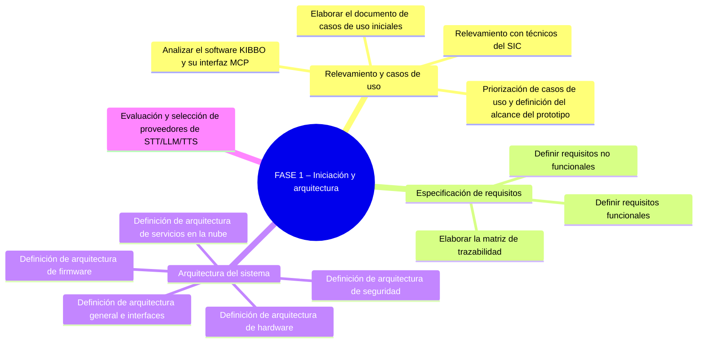
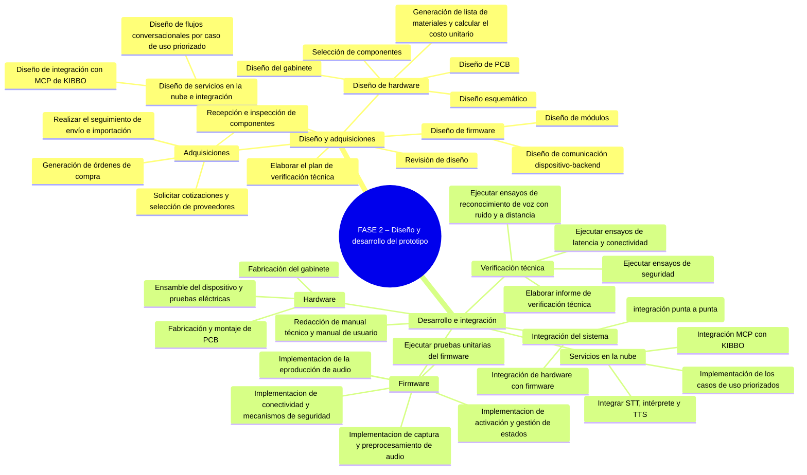
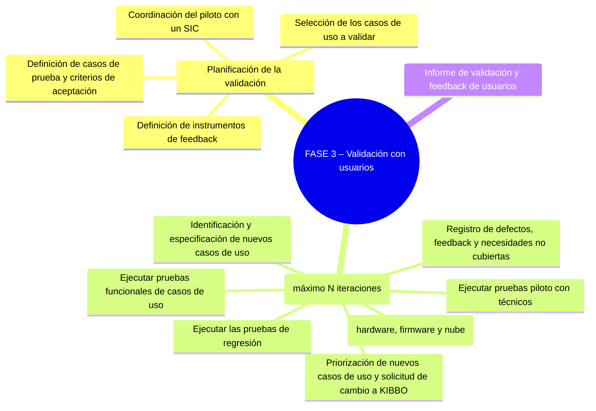
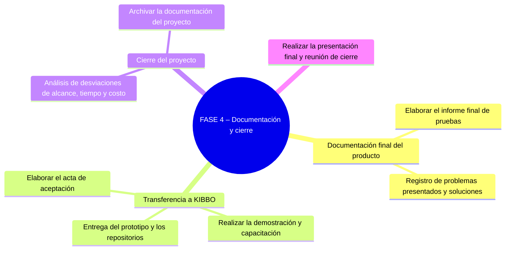

# 🌳 Work Breakdown Structure (WBS)

## Diagrama WBS

## Diccionario de la WBS

| ID | Tarea | Descripción | Criterio de completitud | Entregable asociado |
| :--- | :--- | :--- | :--- | :--- |
| **FASE 1** | **Iniciación y arquitectura** | | | |
| 1.1 | Relevamiento y casos de uso | | | |
| 1.1.1 | Relevamiento con técnicos del SIC | Relevar mediante entrevistas y observación en el taller las tareas, tiempos y frustraciones actuales de los técnicos del SIC en la documentación de mantenimientos. | Se relevó a los técnicos representativos del SIC y sus necesidades quedaron registradas en un informe. | E1.1 Documento de casos de uso y alcance del prototipo |
| 1.1.2 | Analizar el software KIBBO y su interfaz MCP | Analizar las funciones, datos y permisos que expone el software KIBBO a través de su interfaz MCP, para entender qué operaciones puede invocar el asistente. | Se cuenta con un listado de las funciones MCP disponibles en KIBBO y sus parámetros de entrada y salida. | E1.1 Documento de casos de uso y alcance del prototipo |
| 1.1.3 | Elaborar el documento de casos de uso iniciales | Redactar el documento con los casos de uso iniciales del asistente, a partir del relevamiento y de la lista provista en el caso de estudio. | El documento de casos de uso está redactado, revisado por el equipo y disponible para su priorización. | E1.1 Documento de casos de uso y alcance del prototipo |
| 1.1.4 | Priorización de casos de uso y definición del alcance del prototipo | Priorizar los casos de uso relevados y definir cuáles quedan dentro del alcance del prototipo a construir en el proyecto. | La lista de casos de uso priorizados para el prototipo está definida y acordada con KIBBO. | E1.1 Documento de casos de uso y alcance del prototipo |
| 1.2 | Especificación de requisitos | | | |
| 1.2.1 | Definir requisitos funcionales | Redactar los requisitos funcionales del sistema a partir de los casos de uso priorizados. | Cada caso de uso priorizado tiene al menos un requisito funcional asociado y documentado. | E1.2 Documento de especificación de requisitos y matriz de trazabilidad |
| 1.2.2 | Definir requisitos no funcionales | Definir los requisitos no funcionales del sistema, como ruido ambiente admisible, latencia máxima, conectividad, seguridad y costo unitario objetivo. | Los requisitos no funcionales están documentados con valores concretos y acordados con el equipo. | E1.2 Documento de especificación de requisitos y matriz de trazabilidad |
| 1.2.3 | Elaborar la matriz de trazabilidad | Construir la matriz que vincula cada requisito con su caso de uso de origen y con un criterio de aceptación medible. | Todo requisito documentado tiene un caso de uso de origen y un criterio de aceptación asignado en la matriz. | E1.2 Documento de especificación de requisitos y matriz de trazabilidad |
| 1.3 | Arquitectura del sistema | | | |
| 1.3.1 | Definición de arquitectura general e interfaces | Definir los bloques principales del sistema (dispositivo, nube, KIBBO), su responsabilidad y las interfaces de comunicación entre ellos. | El diagrama de bloques y la especificación de cada interfaz están documentados y revisados por el equipo. | E1.3 Documento de arquitectura del sistema |
| 1.3.2 | Definición de arquitectura de hardware | Definir los componentes principales de hardware del dispositivo (microcontrolador, micrófonos, parlante, alimentación) y su interconexión general. | La arquitectura de hardware está documentada a nivel de bloques y componentes principales. | E1.3 Documento de arquitectura del sistema |
| 1.3.3 | Definición de arquitectura de firmware | Definir los módulos principales del firmware (captura de audio, activación, conectividad, gestión de estados) y cómo se relacionan entre sí. | La arquitectura de firmware está documentada con sus módulos principales y sus responsabilidades. | E1.3 Documento de arquitectura del sistema |
| 1.3.4 | Definición de arquitectura de servicios en la nube | Definir la arquitectura de los servicios en la nube (STT, intérprete, TTS, cliente MCP) y su interacción con el dispositivo y con KIBBO. | La arquitectura de los servicios en la nube está documentada con sus componentes y flujos principales. | E1.3 Documento de arquitectura del sistema |
| 1.3.5 | Definición de arquitectura de seguridad | Definir los mecanismos de autenticación del dispositivo, identificación del técnico y cifrado de las comunicaciones del sistema. | Los mecanismos de seguridad del sistema están definidos y documentados para cada interfaz. | E1.3 Documento de arquitectura del sistema |
| 1.4 | Evaluación y selección de proveedores de STT/LLM/TTS | Comparar proveedores u opciones de STT, LLM y TTS con audios de prueba propios, evaluando calidad, latencia, costo y privacidad, y seleccionar la combinación a usar. | Los proveedores de STT, LLM y TTS están seleccionados y la decisión está documentada con su justificación. | E1.4 Informe de evaluación y selección de proveedores STT/LLM/TTS |
| **HITO** | Aprobación de la definición y diseño preliminar del proyecto | | | |
| **FASE 2** | **Diseño y desarrollo del prototipo** | | | |
| 2.1 | Diseño y adquisiciones | | | |
| 2.1.1 | Diseño de hardware | | | |
| 2.1.1.1 | Selección de componentes | Seleccionar los componentes electrónicos del dispositivo (microcontrolador, micrófonos, amplificador, parlante, alimentación) según la arquitectura de hardware definida. | Cada componente necesario tiene un modelo específico seleccionado y disponible en el mercado. | E2.1 Informe de diseño técnico (hardware, firmware y servicios en la nube) |
| 2.1.1.2 | Diseño esquemático | Diseñar el esquemático eléctrico del dispositivo, con las conexiones entre los componentes seleccionados. | El esquemático está terminado y revisado, sin conexiones pendientes o inconsistentes. | E2.1 Informe de diseño técnico (hardware, firmware y servicios en la nube) |
| 2.1.1.3 | Diseño de PCB | Diseñar la placa de circuito impreso a partir del esquemático, definiendo la disposición física de los componentes. | El diseño de PCB está terminado y listo para enviar a fabricar. | E2.1 Informe de diseño técnico (hardware, firmware y servicios en la nube) |
| 2.1.1.4 | Diseño del gabinete | Diseñar el gabinete físico del dispositivo, considerando el tamaño reducido y la acústica de micrófono y parlante. | El diseño del gabinete está terminado y listo para su fabricación. | E2.1 Informe de diseño técnico (hardware, firmware y servicios en la nube) |
| 2.1.1.5 | Generación de lista de materiales y calcular el costo unitario | Elaborar la lista de materiales (BOM) del dispositivo y estimar el costo unitario de fabricación de cada prototipo. | La lista de materiales está completa, con proveedor y precio de referencia para cada ítem, y el costo unitario está calculado. | E2.1 Informe de diseño técnico (hardware, firmware y servicios en la nube) |
| 2.1.2 | Diseño de firmware | | | |
| 2.1.2.1 | Diseño de módulos | Diseñar los módulos principales del firmware (captura de audio, activación, conectividad, máquina de estados) a nivel de funciones e interacciones. | Cada módulo del firmware tiene sus responsabilidades y su interfaz con los demás módulos definidas. | E2.1 Informe de diseño técnico (hardware, firmware y servicios en la nube) |
| 2.1.2.2 | Diseño de comunicación dispositivo-backend | Definir el protocolo, formato de mensajes y manejo de errores de la comunicación entre el dispositivo y los servicios en la nube. | El protocolo de comunicación dispositivo-nube está especificado y documentado, incluyendo los casos de error. | E2.1 Informe de diseño técnico (hardware, firmware y servicios en la nube) |
| 2.1.3 | Diseño de servicios en la nube e integración | | | |
| 2.1.3.1 | Diseño de flujos conversacionales por caso de uso priorizado | Diseñar, para cada caso de uso priorizado, el guion de la conversación entre el técnico y el asistente, incluyendo preguntas, confirmaciones y manejo de errores. | Cada caso de uso priorizado tiene su flujo conversacional documentado y revisado por el equipo. | E2.1 Informe de diseño técnico (hardware, firmware y servicios en la nube) |
| 2.1.3.2 | Diseño de integración con MCP de KIBBO | Diseñar cómo el intérprete invoca las funciones MCP de KIBBO para cada caso de uso, incluyendo qué datos se envían y reciben. | Cada caso de uso priorizado tiene identificada la o las funciones MCP que utiliza y sus parámetros. | E2.1 Informe de diseño técnico (hardware, firmware y servicios en la nube) |
| 2.1.4 | Elaborar el plan de verificación técnica | Definir los ensayos técnicos que se realizarán sobre el prototipo (reconocimiento de voz, latencia, seguridad) y sus criterios de aprobación. | El plan de verificación técnica está redactado, con los ensayos y sus criterios de aprobación definidos. | E2.2 Plan de verificación técnica |
| 2.1.5 | Adquisiciones | | | |
| 2.1.5.1 | Solicitar cotizaciones y selección de proveedores | Solicitar cotizaciones de los componentes de la lista de materiales y seleccionar los proveedores a utilizar. | Cada componente de la lista de materiales tiene un proveedor seleccionado con su cotización aceptada. | |
| 2.1.5.2 | Generación de órdenes de compra | Emitir las órdenes de compra de los componentes seleccionados a cada proveedor. | Todas las órdenes de compra necesarias están emitidas y confirmadas por los proveedores. | |
| 2.1.5.3 | Realizar el seguimiento de envío e importación | Hacer seguimiento del envío y, si corresponde, del trámite de importación de los componentes comprados hasta su llegada. | El estado de envío de cada compra está identificado y no hay demoras sin gestionar. | |
| 2.1.5.4 | Recepción e inspección de componentes | Recibir los componentes comprados e inspeccionarlos para verificar que correspondan a lo solicitado y no presenten daños. | Todos los componentes de la lista de materiales fueron recibidos e inspeccionados sin observaciones pendientes. | |
| 2.1.6 | Revisión de diseño | Revisar en conjunto el diseño de hardware, firmware y servicios en la nube antes de pasar a la etapa de desarrollo. | El diseño fue revisado por el equipo y no quedan observaciones abiertas que bloqueen el desarrollo. | E2.1 Informe de diseño técnico (hardware, firmware y servicios en la nube) |
| **HITO** | Diseño aprobado y componentes recibidos  | | | |
| 2.2 | Desarrollo e integración | | | |
| 2.2.1 | Hardware | | | |
| 2.2.1.1 | Fabricación y montaje de PCB | Fabricar la placa de circuito impreso diseñada y montar sobre ella los componentes electrónicos. | La PCB está fabricada y montada, sin defectos visibles de soldadura o montaje. | |
| 2.2.1.2 | Fabricación del gabinete | Fabricar el gabinete diseñado, por ejemplo mediante impresión 3D u otro método definido. | El gabinete está fabricado y permite alojar correctamente la PCB y los componentes de audio. | |
| 2.2.1.3 | Ensamble del dispositivo y pruebas eléctricas | Ensamblar el dispositivo completo (PCB, componentes y gabinete) y realizar pruebas eléctricas básicas de funcionamiento. | El dispositivo está ensamblado y enciende correctamente, sin fallas eléctricas detectadas. | E2.4 Informe de pruebas eléctricas del hardware |
| 2.2.2 | Firmware | | | |
| 2.2.2.1 | Implementación de captura y preprocesamiento de audio | Programar la captura de audio desde los micrófonos y su preprocesamiento antes de enviarlo a la nube. | El dispositivo captura audio y lo entrega preprocesado en el formato esperado por los servicios en la nube. | E2.5 Documentación del firmware del dispositivo |
| 2.2.2.2 | Implementación de activación y gestión de estados | Programar el mecanismo de activación del dispositivo y la máquina de estados que gestiona su comportamiento. | El dispositivo se activa correctamente y transiciona entre sus estados definidos sin quedar bloqueado. | E2.5 Documentación del firmware del dispositivo |
| 2.2.2.3 | Implementación de conectividad y mecanismos de seguridad | Programar la conexión WiFi del dispositivo, su comunicación con la nube y los mecanismos de autenticación y cifrado definidos. | El dispositivo se conecta a la nube de forma autenticada y cifrada, según lo definido en la arquitectura de seguridad. | E2.5 Documentación del firmware del dispositivo |
| 2.2.2.4 | Implementación de la reproducción de audio | Programar la reproducción por el parlante del dispositivo de las respuestas de audio recibidas desde la nube. | El dispositivo reproduce correctamente el audio recibido, con volumen y calidad adecuados para el taller. | E2.5 Documentación del firmware del dispositivo |
| 2.2.2.5 | Ejecutar pruebas unitarias del firmware | Ejecutar pruebas unitarias sobre los distintos módulos del firmware, incluyendo casos borde como cortes de conexión. | Los módulos del firmware tienen pruebas unitarias ejecutadas y aprobadas, incluyendo los casos borde previstos en el diseño. | E2.5 Documentación del firmware del dispositivo |
| 2.2.3 | Servicios en la nube | | | |
| 2.2.3.1 | Integrar STT, intérprete y TTS | Implementar y conectar la cadena de servicios en la nube que convierte el audio en texto, interpreta el pedido y genera la respuesta hablada. | Un audio de entrada recorre la cadena completa y produce una respuesta de audio coherente, sin intervención manual. | E2.6 Documentación del código de servicios en la nube (STT/intérprete/TTS e integración MCP) |
| 2.2.3.2 | Integración MCP con KIBBO | Implementar la conexión entre los servicios en la nube y KIBBO a través del protocolo MCP, según el diseño de la Fase 1. | Los servicios en la nube pueden invocar las funciones MCP de KIBBO definidas y recibir sus respuestas correctamente. | E2.6 Documentación del código de servicios en la nube (STT/intérprete/TTS e integración MCP) |
| 2.2.3.3 | Implementación de los casos de uso priorizados | Implementar en el intérprete los flujos conversacionales diseñados para cada caso de uso priorizado del prototipo. | Cada caso de uso priorizado está implementado y responde según su flujo conversacional diseñado. | E2.6 Documentación del código de servicios en la nube (STT/intérprete/TTS e integración MCP) |
| 2.2.4 | Integración del sistema | | | |
| 2.2.4.1 | Integración de hardware con firmware | Verificar que el firmware desarrollado funcione correctamente sobre el hardware fabricado del dispositivo. | El firmware corre sobre el hardware final sin errores de compatibilidad ni fallas de funcionamiento. | |
| 2.2.4.2 | Integración del dispositivo con la nube y KIBBO (integración punta a punta) | Probar el sistema completo de punta a punta, desde que el técnico le habla al dispositivo real hasta que la respuesta se refleja en KIBBO. | Un comando de voz real recorre dispositivo, nube y KIBBO, y genera el registro esperado sin intervención manual. | |
| 2.2.5 | Verificación técnica | | | |
| 2.2.5.1 | Ejecutar ensayos de reconocimiento de voz con ruido y a distancia | Ensayar el reconocimiento de comandos de voz del dispositivo en condiciones de ruido de taller y a distintas distancias. | Los ensayos de reconocimiento con ruido y distancia se ejecutaron y sus resultados están registrados. | E2.7 Informe de verificación técnica |
| 2.2.5.2 | Ejecutar ensayos de latencia y conectividad | Medir el tiempo de respuesta del sistema y su comportamiento ante cortes o demoras de conectividad. | Los ensayos de latencia y conectividad se ejecutaron y sus resultados están registrados. | E2.7 Informe de verificación técnica |
| 2.2.5.3 | Ejecutar ensayos de seguridad | Verificar que los mecanismos de autenticación y cifrado definidos funcionan correctamente ante intentos de acceso no autorizado. | Los ensayos de seguridad se ejecutaron y no se detectaron accesos no autorizados durante las pruebas. | E2.7 Informe de verificación técnica |
| 2.2.5.4 | Elaborar informe de verificación técnica | Consolidar los resultados de los ensayos técnicos en un informe que indique si el prototipo cumple los requisitos definidos. | El informe de verificación técnica está redactado y concluye si el prototipo aprueba o no cada ensayo del plan. | E2.7 Informe de verificación técnica |
| 2.2.6 | Redacción de manual técnico y manual de usuario | Redactar una primera versión del manual técnico y del manual de usuario del dispositivo, a partir del diseño y desarrollo realizados. | Existe una versión preliminar de ambos manuales, aunque todavía no incorpore los ajustes de la Fase 3. | E2.8 Manual técnico y de usuario (versión preliminar) |
| **HITO** | Prototipo funcional verificado | | | |
| **FASE 3** | **Validación con usuarios** | | | |
| 3.1 | Planificación de la validación | | | |
| 3.1.1 | Selección de los casos de uso a validar | Seleccionar, entre los casos de uso implementados, cuáles se van a validar formalmente con los técnicos del SIC. | La lista de casos de uso a validar está definida y acordada con el equipo. | E3.1 Plan de validación |
| 3.1.2 | Definición de instrumentos de feedback | Diseñar los instrumentos para recoger el feedback de los técnicos, como encuestas de usabilidad o mediciones de tiempo de registro. | Los instrumentos de feedback están diseñados y listos para usarse durante el piloto. | E3.1 Plan de validación |
| 3.1.3 | Definición de casos de prueba y criterios de aceptación | Elaborar los casos de prueba de los casos de uso seleccionados, con sus criterios de aceptación, a partir de la matriz de trazabilidad. | Cada caso de uso a validar tiene al menos un caso de prueba con su criterio de aceptación definido. | E3.1 Plan de validación |
| 3.1.4 | Coordinación del piloto con un SIC | Coordinar con un Servicio de Ingeniería Clínica el sitio, los técnicos participantes y las autorizaciones necesarias para el piloto. | El SIC, los técnicos participantes y las fechas del piloto están confirmados. | E3.1 Plan de validación |
| 3.2 | Ciclo de validación (máximo N iteraciones) | | | |
| 3.2.1 | Ejecutar pruebas funcionales de casos de uso | Ejecutar los casos de prueba definidos sobre los casos de uso seleccionados y registrar sus resultados. | Todos los casos de prueba de la iteración fueron ejecutados y sus resultados quedaron registrados. | E3.2 Registros de pruebas piloto y feedback |
| 3.2.2 | Ejecutar pruebas piloto con técnicos | Hacer que técnicos del SIC usen el dispositivo en su trabajo real, combinando casos guiados con uso libre. | Los técnicos participantes usaron el dispositivo en el taller durante el período previsto de la iteración. | E3.2 Registros de pruebas piloto y feedback |
| 3.2.3 | Registro de defectos, feedback y necesidades no cubiertas | Registrar los defectos detectados, los comentarios de los técnicos y los pedidos que el sistema todavía no puede resolver. | El feedback, los defectos y las necesidades no cubiertas de la iteración quedaron documentados. | E3.2 Registros de pruebas piloto y feedback |
| 3.2.4 | Identificación y especificación de nuevos casos de uso | Especificar formalmente los casos de uso nuevos detectados durante la iteración que no estaban contemplados originalmente. | Cada necesidad no cubierta relevante quedó especificada como un caso de uso nuevo documentado. | E3.2 Registros de pruebas piloto y feedback |
| 3.2.5 | Priorización de nuevos casos de uso y solicitud de cambio a KIBBO | Priorizar los casos de uso nuevos y presentar a KIBBO la solicitud de cambio de alcance para los que se decida implementar. | Los casos de uso nuevos están priorizados y KIBBO aprobó o rechazó cada solicitud de cambio. | E3.2 Registros de pruebas piloto y feedback |
| 3.2.6 | Ajuste del producto (hardware, firmware y nube) | Corregir los defectos detectados e implementar los casos de uso nuevos aprobados, en hardware, firmware o servicios en la nube según corresponda. | Los defectos y casos de uso aprobados de la iteración están corregidos o implementados. | E3.3 Producto ajustado (versión validada) |
| 3.2.7 | Ejecutar las pruebas de regresión | Volver a ejecutar los casos de prueba ya aprobados en iteraciones anteriores para confirmar que los ajustes no rompieron nada. | Todos los casos de prueba de regresión de la iteración pasaron sin generar nuevos defectos. | E3.3 Producto ajustado (versión validada) |
| 3.3 | Informe de validación y feedback de usuarios | Consolidar en un informe los resultados de la validación, el feedback de los usuarios y los casos de uso nuevos identificados y priorizados. | El informe de validación está redactado y refleja el estado final de cada caso de uso y los casos futuros documentados. | E3.4 Informe de validación y feedback de usuarios |
| **HITO** | Se completa una iteración de pruebas piloto en la que no se identifican nuevos casos de uso de prioridad alta, o se alcanza el máximo de N iteraciones. En ambos casos, los casos de uso implementados cumplen sus criterios de aceptación y los no implementados quedan documentados y priorizados para desarrollos futuros. | | | |
| **FASE 4** | **Documentación y cierre** | | | |
| 4.1 | Documentación final del producto | | | |
| 4.1.1 | Elaborar el informe final de pruebas | Consolidar en un informe final los resultados de todas las pruebas técnicas y de validación realizadas durante el proyecto. | El informe final de pruebas está redactado y cubre tanto la verificación técnica como la validación con usuarios. | E4.1 Informe final de pruebas y registro de problemas |
| 4.1.2 | Registro de problemas presentados y soluciones | Documentar los principales problemas técnicos o de gestión que surgieron durante el proyecto y cómo se resolvieron. | Los problemas relevantes del proyecto están documentados junto con la solución adoptada en cada caso. | E4.1 Informe final de pruebas y registro de problemas |
| 4.2 | Transferencia a KIBBO | | | |
| 4.2.1 | Entrega del prototipo y los repositorios | Entregar a KIBBO el prototipo físico final junto con los repositorios de firmware, servicios en la nube y diseño de hardware. | KIBBO recibió el prototipo y tiene acceso a todos los repositorios del proyecto. | E4.2 Prototipo final entregado a KIBBO |
| 4.2.2 | Realizar la demostración y capacitación | Realizar una demostración del funcionamiento del prototipo a KIBBO y capacitar a quien vaya a operarlo o darle seguimiento. | La demostración y la capacitación se realizaron y los asistentes de KIBBO pudieron operar el dispositivo por sí mismos. | E4.2 Prototipo final entregado a KIBBO |
| 4.2.3 | Elaborar el acta de aceptación | Redactar el acta que documenta la aceptación formal del prototipo por parte de KIBBO como sponsor del proyecto. | El acta de aceptación está redactada y firmada por el sponsor. | E4.3 Acta de aceptación |
| 4.3 | Cierre del proyecto | | | |
| 4.3.1 | Análisis de desviaciones de alcance, tiempo y costo | Comparar lo planificado con lo ejecutado en alcance, tiempo y costo, e identificar las causas de las principales desviaciones. | El análisis de desviaciones está redactado y cubre alcance, tiempo y costo del proyecto. | E4.4 Informe de cierre del proyecto |
| 4.3.2 | Archivar la documentación del proyecto | Reunir y archivar toda la documentación generada durante el proyecto en un repositorio ordenado y accesible. | Toda la documentación del proyecto está archivada en un único repositorio ordenado. | E4.4 Informe de cierre del proyecto |
| 4.4 | Realizar la presentación final y reunión de cierre | Presentar los resultados del proyecto a KIBBO, y realizar la reunión formal de cierre con el equipo. | La presentación final y la reunión de cierre se realizaron con los interesados correspondientes. | E4.4 Informe de cierre del proyecto |
| **HITO** | Acta de aceptación firmada | | | |
| **5.0** | **GESTIÓN DEL PROYECTO (transversal a todas las fases)** | | | |
| 5.1 | Planificación: acta de constitución, EDT y diccionario, cronograma, presupuesto, planes de riesgos, comunicaciones y adquisiciones | Elaborar los documentos de planificación del proyecto: acta de constitución, EDT y su diccionario, cronograma, presupuesto y planes de riesgos, comunicaciones y adquisiciones. | Todos los documentos de planificación listados están elaborados y aprobados por el equipo. | E5.1 Plan de gestión del proyecto (entregable de gestión, no forma parte de los entregables al cliente) |
| 5.2 | Seguimiento y control: reuniones periódicas, informes de avance, control de cambios | Realizar reuniones periódicas de seguimiento, elaborar informes de avance y gestionar las solicitudes de cambio del proyecto. | Las reuniones de seguimiento se realizan según lo planificado y cada solicitud de cambio queda registrada con su resolución. | E5.2 Informes de avance y registro de cambios (entregable de gestión, no forma parte de los entregables al cliente) |
| 5.3 | Monitoreo de riesgos | Revisar periódicamente los riesgos identificados del proyecto, actualizar su probabilidad e impacto e incorporar riesgos nuevos. | El registro de riesgos está actualizado y revisado en cada hito de fase del proyecto. | E5.3 Registro de riesgos actualizado (entregable de gestión, no forma parte de los entregables al cliente) |
| 5.4 | Comunicación con interesados (KIBBO, SIC) | Mantener la comunicación periódica con KIBBO y con el SIC piloto según lo definido en el plan de comunicaciones. | Los interesados reciben la información prevista en el plan de comunicaciones con la frecuencia acordada. | |

---

*Cátedra Gestión de Proyectos · FIUNER · 2026*
